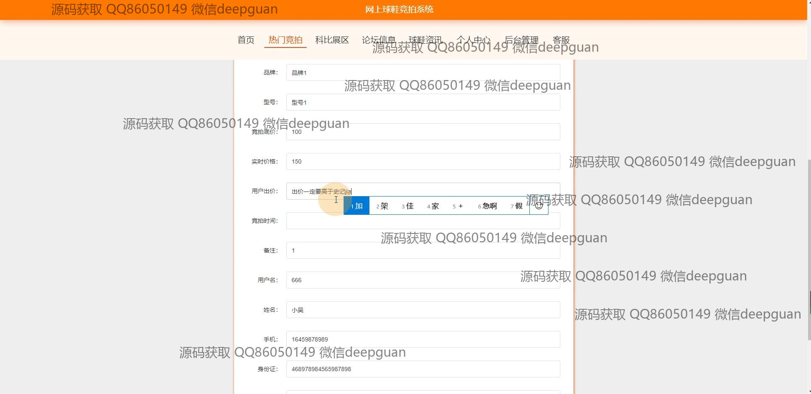

<h1 align="center">的球鞋商品竞拍卖网站vue</h1>

## 简介
球鞋竞拍网站：角色分为管理员、用户；个人信息管理、竞拍信息管理、商品分类管理、论坛交流与评论管理，采用Vue与SSM框架开发，界面设计简洁明了。    --计算机毕业设计源码；毕设源码；java毕业设计源码

## 联系方式

<h3 align="center">获取完整代码与数据库文件 + 微信：deepguan QQ: 86050149 QQ群: 783742310</h3>

<h3 align="center">可帮忙远程部署 包运行成功！提供远程部署、修改代码、设计文档指导、代码讲解等服务！</h3>

## 功能介绍（完整见运行截图）
管理员：提供全面的用户管理，包括注册、登录和账户查询。通过后台界面，可以进行球鞋分类管理、竞拍信息管理、用户信息管理和商城资讯内容的更新维护。支持商品新增、分类编辑及管理用户评论和消息通知。论坛功能方便管理员互动管理，科比展区和其他功能模块的内容调动保障网站顺畅运营。个人中心提供管理工具，确保后台操作人员的高效性和敏捷性。

用户：注册后，可以访问个人中心，管理个人信息如用户名、密码、手机号、邮箱等。参与竞拍商品，包括查看和提交商品竞拍数据。导航栏提供对热门竞拍、球鞋资讯、论坛的快速访问和参与。用户评论和收藏功能丰富了参与感，消息通知管理保证用户及时获取竞拍动态。论坛和展区功能让用户能分享观点或获取最新球鞋资讯，同时可进行商品浏览、竞拍参与以及反馈互动。

## 运行截图

本代码来源于网络,仅供学习参考使用!

